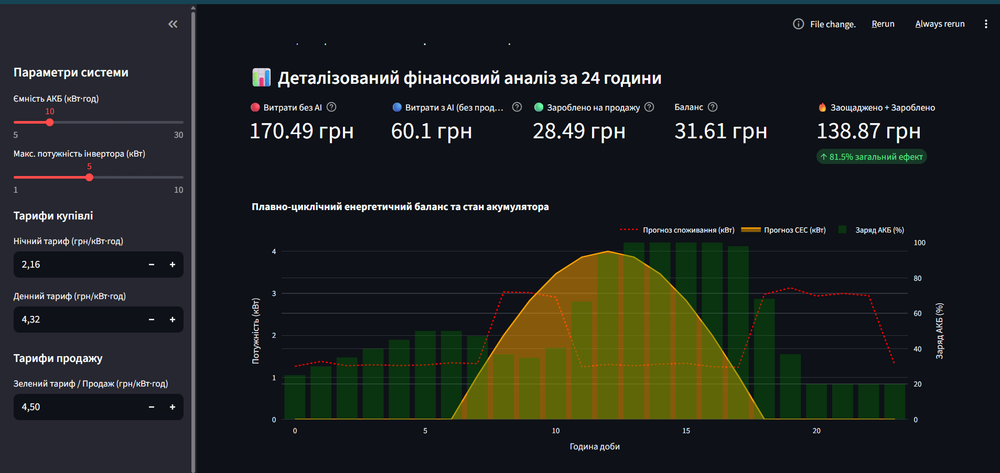
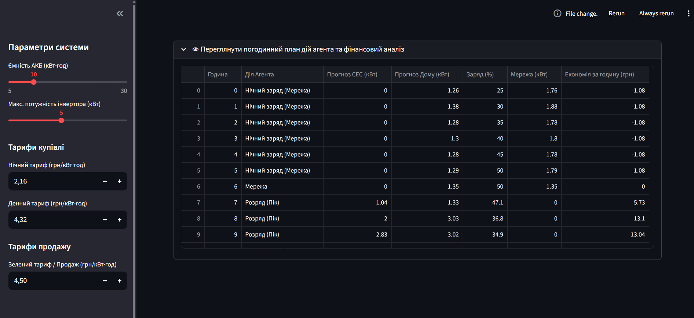

# Завдання варіанту 20

## Умова

Агент планування роботи інвертора.
Оптимізація режимів роботи інвертора.
Методи: rule-based + ML.

## Виконання

### [Код програми](app.py)

### 1. Джерела даних
Для навчання та валідації моделей прогнозування ШІ-агента використовуються синтетичні дані, що детально симулюють реальні фізичні та споживчі процеси об'єкта протягом тридцяти діб, що сумарно складає 720 годин. Генератор даних відтворює два незалежні часові ряди, першим з яких є прогноз споживання будинку. Базове навантаження об'єкта коливається в межах від 0.5 до 1.5 кВт із додаванням випадкового шуму та штучним моделюванням двох виражених добових піків, а саме ранкового з восьмої до десятої години та вечірнього з вісімнадцятої до двадцять другої години, коли споживання додатково зростає на 2.0 кВт через активність мешканців. Другим часовим рядом є прогноз генерації сонячної електростанції, який виконує математичну симуляцію сонячної інсоляції за допомогою синусоїдальної функції у денне вікно з шостої ранку до вісімнадцятої години вечора із максимальним піком генерації до 4.0 кВт о дванацятій годині, тоді як у нічні години генерація примусово прирівнюється до нуля.

---

### 2. Pipeline обробки даних
Конвеєр обробки даних у додатку побудований за принципом мінімальної затримки та оптимізації оперативної пам'яті за допомогою вбудованого механізму кешування Streamlit. 

Процес починається з етапу генерації та збору даних, де створюється безперервний масив часових міток із погодинною частотою для сумісності з новішими версіями інструментів обробки. Після цього на етапі очищення та трансформації формуються цільові ознаки споживання та генерації, а також виділяється ключовий предиктор, яким виступає поточна година доби. На фінальному етапі конвеєра відбувається розподіл даних, під час якого сформована інформація структурується у вигляді матриці ознак і векторів цільових змінних для безпосередньої передачі в ШІ-модуль.

---

### 3. Модель / Алгоритм
Замість використання класичних статистичних середніх значень, для передбачення енергетичного балансу інтегровано дві незалежні моделі машинного навчання на основі алгоритму ансамблю випадкових лісових дерев Random Forest Regressor. Моделі конфігуруються зі ста деструктивними деревами та фіксованим станом генератора випадкових чисел для забезпечення повної відтворюваності результатів при кожному запуску. 

Під час роботи алгоритму перша модель спеціалізується на розпізнаванні складних патернів поведінки мешканців будинку та фіксації стрибків споживання, тоді як друга модель аналізує нелінійну криву сонячної активності. На основі вивчених історичних закономірностей за минулий місяць ШІ-модуль формує точний регресійний прогноз на наступні 24 години для кожної точки часу окремо.

---

### 4. Агентна логіка
Агент працює за принципом гібридного інтелекту, поєднуючи в собі прогнози машинного навчання та планово-циклічні правила поведінки для управління інвертором. Щогодини агент аналізує чистий баланс системи, що визначається як різниця між генерацією та споживанням, а також враховує діючі фінансові маркери, включаючи двозонний тариф купівлі та Зелений тариф продажу електроенергії. У випадку виникнення надлишку сонячна енергія першочергово живить будинок, а її залишок спрямовується на зарядку акумулятора, причому після досягнення повного заряду агент перенаправляє надлишок у зовнішню мережу для фіксації прибутку. У періоди дефіциту енергії агент активує один із трьох алгоритмів, серед яких плановий нічний заряд сходинками від дешевої мережі з 00:00 до 05:00 для досягнення 50% заряду, вечірній або ранковий розряд акумулятора до безпечного ліміту в 20% для зрізання пікових тарифів, або прямий транзит енергії з мережі, коли акумулятор повністю виснажений, що в комплексі забезпечує циклічність і стабільність системи день за днем.

---

### 5. Інтерфейс
Взаємодія з ШІ-агентом реалізована у вигляді інтерактивного та адаптивного веб-інтерфейсу на базі сучасного фреймворку Streamlit (рис. 1). У лівій частині екрану розташована бічна панель параметрів, яка дозволяє користувачу налаштовувати фізичні ліміти системи, такі як ємність акумулятора та потужність інвертора, а також вводити актуальну вартість денного, нічного тарифів, та тарифу продажу наждишкової енергії. Основний екран програми містить блок фінансового аудиту, що складається з п'яти динамічних карток для відображення витрат без ШІ, чистих витрат з ШІ, доходу від продажу енергії, фінального балансу майбутньої платіжки та сумарного грошового ефекту. Нижче розташована інтерактивна візуалізація у вигляді комбінованого графіка Plotly, який поєднує криві прогнозів із гістограмою стану заряду батареї, а під ним розміщено розгортаємий табличний аудит (рис. 2), який містить текстовий лог кожної дії агента та детальну калькуляцію по кожній годині.

 Рисунок 1 - Інтерфейс програми

 Рисунок 2 - Таблиця з погодинною інформацією

---

### 6. Метрики якості
Ефективність та стабільність розробленого ШІ-агента оцінюється комплексно за допомогою трьох практичних критеріїв, які розраховуються безпосередньо всередині програмного коду додатка. Головним критерієм успішності оптимізації є метрика загального економічного ефекту, яка вираховується у відсотках як відношення збережених та зароблених за добу коштів до базових витрат користувача без використання інтелектуальної системи. 

Другим критично важливим індикатором якості є коефіцієнт циклічної стабільності акумуляторної батареї, який контролює різницю між рівнем заряду на початку доби о 00:00 та в момент її завершення о 23:00. Завдяки розробленому алгоритму планової нічної підзарядки цей показник стабільно дорівнює нулю, що гарантує довгострокову життєздатність системи та виключає накопичувальний дефіцит енергії при переході на наступні доби. 

Третім показником виступає технічна метрика швидкодії інтерфейсу, тобто сумарний час, необхідний процесору для завантаження історичного масиву даних, паралельного навчання двох регресійних моделей випадкового лісу та прорахунку двадцяти чотирьох годинних рішень агента, демонструючи стабільний результат у межах 350 мілісекунд, що повністю задовольняє вимогам роботи систем керування у режимі реального часу.
