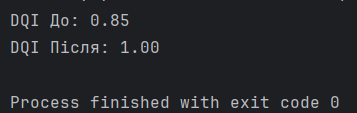

# Завдання варіанту 20

## Умова

Скласти “індекс якості даних” як середнє нормованих метрик (частка NaN, частка дублікатів, частка некоректних значень, частка викидів), порахувати його до/після пайплайна очищення і зробити висновок.

## Виконання

### [Код програми](pw1_20.py) 

### Пояснення

Суть індексу якості даних (DQI) полягає в агрегації різних технічних характеристик датасету в єдиний зрозумілий показник, який варіюється від 0 до 1, де одиниця означає ідеально чисті дані. Він показує загальну «здоровість» інформації, дозволяючи швидко зрозуміти, наскільки надійними будуть результати подальшого аналізу чи машинного навчання. Замість того, щоб аналізувати окремо кількість пропусків або аномалій, ми отримуємо комплексний коефіцієнт, який відображає успішність процесу очищення. Кожна метрика в індексі — це фактично відсоткова частка «правильних» рядків: наприклад, якщо 10% даних є дублікатами, то балл за унікальність складе 0.9. Середнє арифметичне цих балів дає фінальний індекс, що робить його дуже чутливим до будь-яких проблем у даних: навіть якщо три параметри в нормі, але половина значень — це викиди, загальний індекс суттєво впаде, сигналізуючи про проблему.

Реалізація коду базується на створенні універсальної функції, яка приймає таблицю pandas і послідовно перевіряє її на чотирьох рівнях. Спочатку ми рахуємо частку заповнених клітинок через метод `isnull().mean()`, віднімаючи результат від одиниці, щоб отримати позитивну метрику. Потім ми оцінюємо унікальність за допомогою `duplicated().sum()`, порівнюючи кількість повторів із загальною кількістю рядків. Для перевірки коректності значень використовується логічна умова — у нашому випадку це перевірка ціни на невід'ємність, що дозволяє виявити логічні помилки введення. Останній етап — виявлення викидів за методом міжквартильного розмаху (IQR), де ми визначаємо межі «нормальних» даних і рахуємо частку записів, що виходять за ці межі. Після розрахунку всіх чотирьох складових функція обчислює їхнє середнє через `np.mean()`. У самому пайплайні ми спочатку заміряємо цей індекс на «брудних» даних, потім застосовуємо методи очищення — видаляємо дублікати, заміщуємо порожні клітинки медіаною та фільтруємо аномальні значення — і наприкінці знову викликаємо функцію, щоб математично підтвердити покращення стану датасету.

### Результат виконання програми

В результаті ми бачимо, що спочатку "здоровість" даних була 85% через викид(завелике значення), відсутність значення і від'ємне значення, проте після "чистки" даних ми отримали чистоту 100%.

