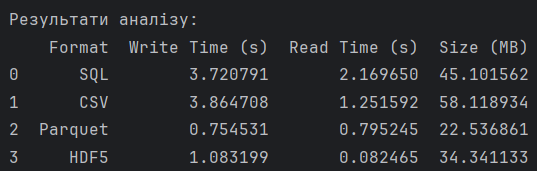

# Завдання варіанту 20

## Умова

Збережіть великі енергетичні дані у форматах CSV, Parquet, HDF5 та порівняйте швидкість читання/запису з попередньою реалізацією у SQL.
Цей розширений аналіз дозволить оцінити ефективність нових методів у порівнянні з класичними підходами.

## Виконання

### [Код основної програми](pw4_20_main.py)
### [Код програми візуалізації](visualize_data.py) 

### Пояснення

Суть цього завдання полягає у порівнянні швидкості запису і читання у різних форматах. Чому саме ці формати? Бо вони підходять для зберігання та аналізу даних. Детальніше про кожен формат:

**SQL**
- Переваги: легка навігація бо датасету. Ви можете легко обрати необхідну вам клітинку. Записи виконуються рядками.
- Недоліки: через небінарну структуру займає більше місця та довше читається/записується при роботі з усією БД, оскільки створює додаткове навантаження на систему.
- Для чого підходить: для систем де дані постійно оновлюються. Через свою структуру SQL дозволяє легка редагувати існуючі та створювати нові записи.

**CSV**
- Переваги: легкий запис через кому. Універсальним, бо є просто текстовим файлом, тому можна відкрити через різні блокноти, Excel та інші програми.
- Недоліки: дуже повільний, бо числа зберігаються як символи і займають більше місця в пам'яті.
- Для чого підходить: для передачі даних між системами або для зберігання для невеликих наборів даних.

**Parquet**
- Суть: зберігає дані у бінарному вигляді у форматі стовпчиків (а не рядками як в SQL).
- Переваги: займає менше місця в пам'яті та швидше обробляються системою через бінарний запис. Кожень стовпець повністю складається з записів одного типу, через що його можна краще стискати, і зменшувати об'єм файлу. Через систему зберігання можемо читати конкретний стовпець, а не викачувати усі, тож ми економимо ресурс.
- Мінуси: через зберігання даних у стовпчиках, важко дописувати новий рядок даних (потрібно переписувати файл або блок).
- Для чого підходить: аналітика великих даних, машинне навчання, довготривале зберігання архівів.

**HDF5**
-Суть: його структуру можна описати як "файл у файлі". Його можна уявити як окрему файлову систему або "ZIP-архів без стиснення", де всередині одного файлу можна створювати папки (groups) та зберігати різні масиви даних (datasets).
-Переваги: він ідеально працює з багатовимірними масивами (тензорами). Якщо потрібно зберегти 3D-модель погоди або гігантську матрицю нейронної мережі, HDF5 впорається з цим найкраще. Він дозволяє зчитувати випадкові шматки даних (наприклад, тільки середину гігантської матриці), не завантажуючи все інше.
- Недоліки: файли можуть бути дещо "крихкими" (якщо запис перерветься, файл може пошкодитись).
- Для чого підходить: зберігання даних з сенсорів, результатів фізичних експериментів, аудіо/відео сигналів.

В коді було використано SQLite (тей же SQL, просто зберігається у файлі на пристрої, а не на сервері).

Для перевірки швидкості запису та читання кожного з форматів, в них було записано 1 000 000 рядків з даними про часову мітку, енергоспоживання, напругу та ID підстанції (timestamp, energy_consumption, voltage, station_id). Під час запису вимірювали час. 

Для SQL (energy_data.db) читання виконувалося функцією pd.read_sql. Процес відбувався через встановлення з'єднання з файлом бази даних, після чого двигун SQLite обробляв запит SELECT *. Дані витягувалися з диска рядками, проходили через SQL-інтерфейс і лише потім перетворювалися на табличну структуру DataFrame у пам'яті.

Для CSV (data.csv) читання здійснювалося функцією pd.read_csv. Це був процес текстового парсування: Python зчитував файл як потік символів, шукав коми як роздільники рядків, розбивав текст на окремі елементи та виконував складну операцію «інференсу» (вгадування) типів даних, щоб перетворити кожен текстовий рядок на число або дату.

Для Parquet (data.parquet) використовувалася функція pd.read_parquet. Читання відбувалося за колоночним принципом: програма спочатку зверталася до метаданих у кінці файлу, щоб дізнатися адреси потрібних стовпців, а потім зчитувала лише стиснуті блоки даних. Процес включав декомпресію (розпакування) бінарних блоків безпосередньо в пам'ять, що значно прискорило завантаження.

Для HDF5 (data.h5) читання проводилося функцією pd.read_hdf. Тут застосовувався метод прямого доступу до бінарних масивів. Оскільки структура даних у файлі HDF5 майже ідентична структурі масивів у пам'яті комп'ютера, Pandas просто копіював готові блоки байтів, оминаючи етапи парсування або складного декодування, що забезпечило дуже високу швидкість обробки великих масивів чисел.

Після усіх замірів результати виводяться в консоль та у вигляді візуальних стовпчикових діаграм, для легшого порівняння.

### Результат виконання програми

Результати показали, що найдовшими є формати SQL і CSV, оскільки вони зберігають дані у "людьскому форматі", в тей час як швидкі формати Parquet та HDF зберігають дані у бінарному форматі, що спрощує їх запис та читання для комп'ютера. Також через бінерне зберігання HDF5 та Parquet можуть сильно стискатись, через що вони займають менше місця ніж SQl та CSV. Формат CSV виявився найбільшим через найбільшу кількість символів, що зберігаються.

