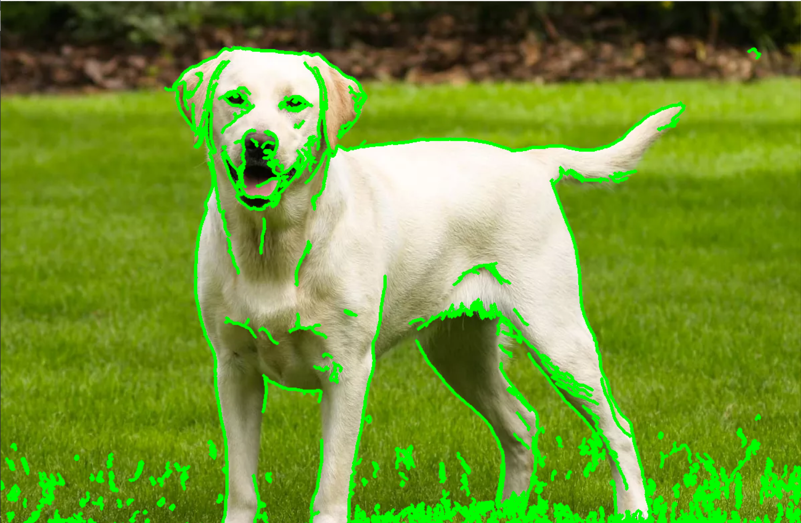
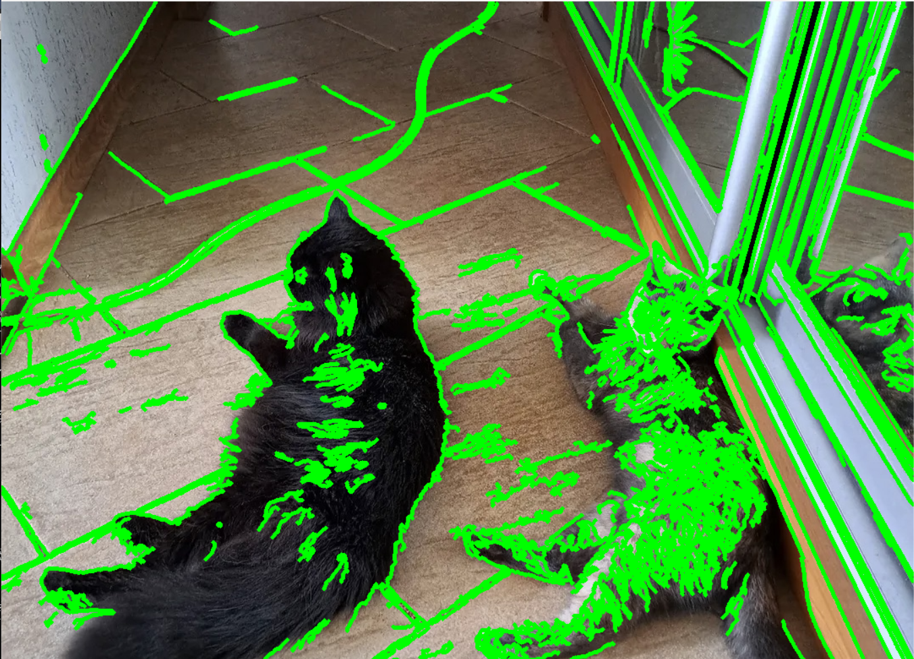
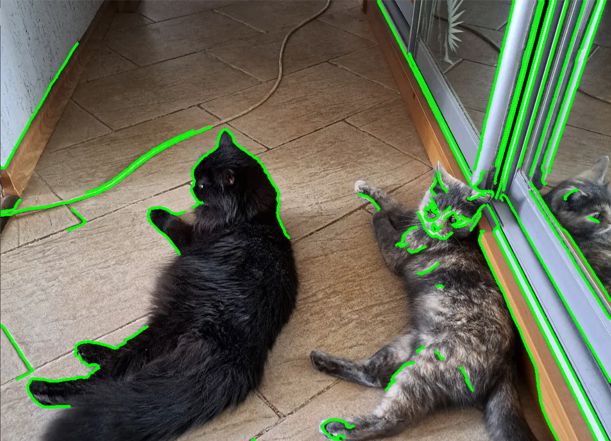
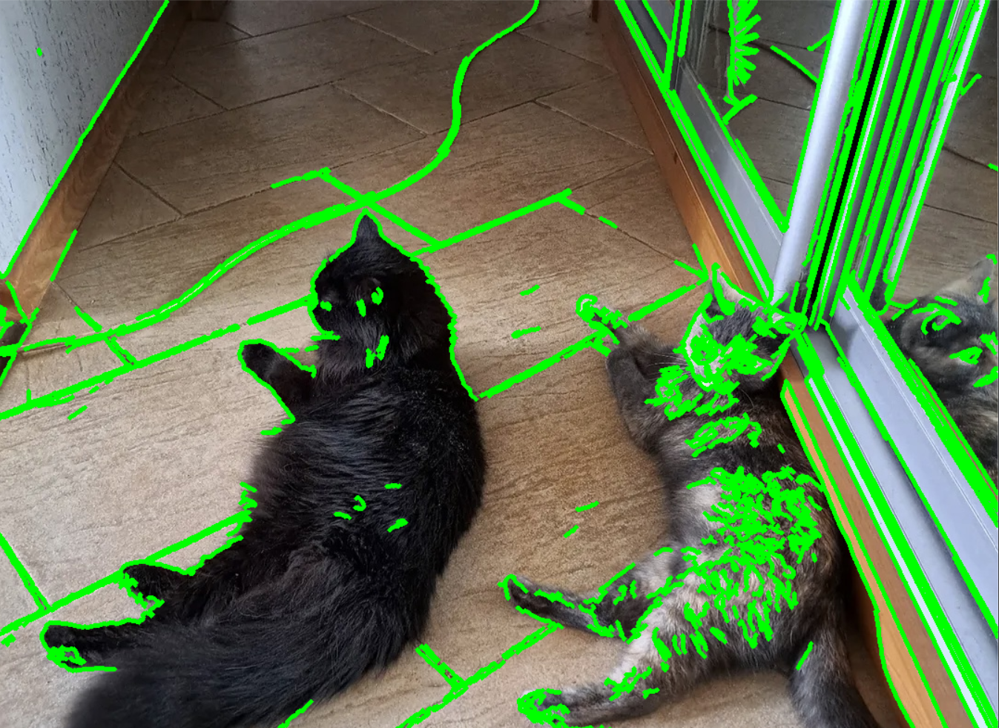

# Завдання варіанту 20

## Умова

Обробка зображень: Написати код для обробки зображень, наприклад, для виділення контурів об'єктів у зображенні за допомогою бібліотеки opencv.

## Виконання

### [Код програми](pw5_20.py)

### Пояснення

Програма для виділення контурів об'єктів побудована на базі бібліотеки OpenCV і використовує класичний багатоетапний підхід до обробки цифрових зображень. Основним завданням алгоритму є перетворення масиву пікселів у векторні дані, що описують межі об'єктів. Весь процес можна розділити на кілька ключових стадій: попередню підготовку, фільтрацію, детекцію меж та фінальну візуалізацію.

На першому етапі програма зчитує вхідне кольорове зображення та переводить його у формат Grayscale (відтінки сірого). Це важливий крок, оскільки для алгоритмів пошуку контурів колірна інформація є надлишковою, набагато важливішим є градієнт яскравості. Після цього застосовується фільтр Гаусса (Gaussian Blur). Ця операція розмиває дрібні деталі та цифровий шум, які могли б бути помилково сприйняті програмою як контури. Важливою технічною особливістю тут є використання ядра непарного розміру, що забезпечує наявність центрального пікселя для коректних математичних розрахунків.

Основним ядром програми є алгоритм Кенні (Canny Edge Detection). Він аналізує інтенсивність зміни яскравості між сусідніми пікселями. Алгоритм використовує метод подвійної порогової фільтрації (гістерезис) для відсікання слабких ліній та збереження лише чітких меж. Пікселі, яскравість яких перевищує верхній поріг, автоматично вважаються частиною контуру, а ті, що знаходяться між порогами, приєднуються лише за умови їхнього фізичного зв'язку з основними лініями. Це дозволяє отримати тонкі та безперервні межі об'єктів.

Завершальний етап полягає у виділенні топологічної структури об'єктів за допомогою функції пошуку контурів. На відміну від детектора Кенні, який просто підсвічує краї, ця функція групує знайдені точки у зв'язні масиви координат. Отримані дані дозволяють програмі не тільки ідентифікувати форму об'єкта, але й нанести кольорове обведення поверх оригінального зображення. Такий підхід забезпечує наочність результату, демонструючи точність розпізнавання меж предметів на фото.

Для налаштування точності роботи програми користувач може керувати трьома основними параметрами. Першим є розмір ядра розмиття Гаусса (наприклад, 5x5, 7x7) (Рядок `blurred = cv2.GaussianBlur(gray, (5, 5), 0)`). Збільшення цього показника призводить до сильнішого згладжування зображення: програма починає ігнорувати дрібні деталі, текстуру об'єктів та дрібний цифровий шум, фокусуючись лише на великих формах. Це корисно для виділення масивних предметів, проте надмірне розмиття може призвести до того, що тонкі лінії або дрібні об'єкти просто зникнуть із поля зору алгоритму. Важливо пам'ятати, що ці значення завжди мають бути непарними для коректної роботи математичного фільтра.

Наступними критичними параметрами є нижній та верхній пороги детектора Кенні (Рядок `edges = cv2.Canny(blurred, 50, 150)`). Нижній поріг визначає мінімальну інтенсивність градієнта, яку програма ще вважатиме потенційним контуром. Якщо його зменшити, програма стане надчутливою і почне обводити навіть ледь помітні тіні або переходи кольорів. Верхній поріг відповідає за «впевненість» алгоритму: пікселі з контрастом вище цього рівня гарантовано стають частиною контуру. Зближення цих порогів робить лінії більш фрагментованими, тоді як великий розрив між ними дозволяє отримувати довгі, цілісні та плавні контури. Змінюючи ці числа, можна адаптувати програму під різні умови освітлення та рівень контрастності об'єктів відносно фону.

Результатом роботи програми є генерація трьох послідовних візуальних представлень та статистичних даних у консолі. По-перше, програма виводить вихідне зображення для порівняння. По-друге, відображається бінарна маска (чорно-біла карта країв), де білі лінії на чорному фоні показують усі знайдені алгоритмом межі. По-третє, користувач отримує фінальне кольорове зображення, на якому поверх оригіналу нанесене графічне обведення (контур) знайдених об'єктів, що дозволяє наочно оцінити точність роботи. Додатково в термінал виводиться числове значення — загальна кількість виявлених замкнених контурів, що дає змогу використовувати програму для автоматичного підрахунку об'єктів на фото.

### Результат виконання програми

За базових параметрів (були вказані в поясненні) програма добре ідентифікує контури на чітких фото (рис. 1), проте якщо брати фото з більшою кількістю "перепадів", то з'являється забагато об'єктів (рис. 2).

 Рисунок 1

 Рисунок 2

Можна змінити розмір ядра до 15*15, проте це сильно зменшить кількість контурів (рис. 3).

 Рисунок 3

Можна спробувати змінювати чутливість алгоритму, корегуючи верхній та нижній поріг детектора Кенні, наприклад до `(100; 200)` (рис. 4). Це теж зменшить кількість контурів, але ми будемо бачити менше зайвого.

 Рисунок 4

У висновку хотілося б сказати, що цей алгоритм є хорошим у випадку, якщо фото має дуже хорошу чіткість. Фото з тваринами є дуже хорошим випробовуванням для таких програм, оскільки шесть робить конутри менш чіткими та більш складними для виявлення. 
